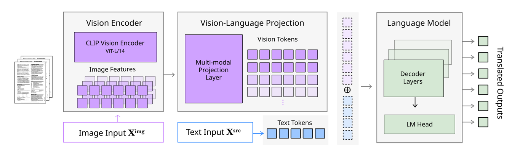

# TransMLLM: Multimodal Multilingual Multitask Document Understanding for Low-Resource Languages




## Abstract

TransMLLM is a multimodal multilingual document translation model that leverages Large Multimodal Models (LMMs) for document image machine translation. The model is based on LLaVA-Next-7B and supports 11 languages including English, Vietnamese, Indonesian, Uzbek, Russian, Japanese, Kazakh, Chinese Simplified, Chinese Traditional, and Korean.

## Quick Start

### Installation

```bash
# Navigate to the project directory
cd TransMLLM

# Create virtual environment
python -m venv venv
source venv/bin/activate  # On Windows: venv\Scripts\activate

# Install dependencies
pip install -r requirements.txt
```

### Quick Inference Example

```python
from codes.inference import inference

# Example: Translate multilingual document
result = inference(
    model_path="./checkpoints/transmllm_lora",
    image_path="./examples/sample_data/multilingual-document/00.jpg",
    source_lang="en",
    target_lang="kk"
)
print(result)

# Example: Translate Kazakh document
result = inference(
    model_path="./checkpoints/transmllm_lora",
    image_path="./examples/sample_data/multilingual-multimodal-translation/kk/kk_0001.png",
    source_lang="kk",
    target_lang="en"
)
print(result)
```

### Quick Training Example

```bash
# LoRA fine-tuning
bash scripts/train_lora.sh

# Full fine-tuning
bash scripts/train_full.sh
```

## Installation

### System Requirements

- Python 3.8+
- CUDA 11.8+ (for GPU training)
- 16GB+ GPU memory (for full fine-tuning)
- 8GB+ GPU memory (for LoRA fine-tuning)

### Environment Setup

1. Create a virtual environment:
```bash
python -m venv venv
source venv/bin/activate  # On Windows: venv\Scripts\activate
```

2. Install PyTorch (adjust CUDA version as needed):
```bash
pip install torch torchvision torchaudio --index-url https://download.pytorch.org/whl/cu118
```

3. Install dependencies:
```bash
pip install -r requirements.txt
```

### Model Download

The base model (LLaVA-Next-7B) will be automatically downloaded from HuggingFace when you run the training or inference scripts.

## Usage

### Training

#### LoRA Fine-tuning

```bash
python codes/training/train_lora.py \
    --config configs/train_lora.yaml \
    --output_dir ./checkpoints/transmllm_lora
```

Or use the shell script:
```bash
bash scripts/train_lora.sh
```

#### Full Fine-tuning

```bash
python codes/training/train_full.py \
    --config configs/train_full.yaml \
    --output_dir ./checkpoints/transmllm_full
```

Or use the shell script:
```bash
bash scripts/train_full.sh
```

### Inference

```bash
# Example: Translate multilingual document
python codes/inference/inference.py \
    --model_path ./checkpoints/transmllm_lora \
    --image_path ./examples/sample_data/multilingual-document/00.jpg \
    --source_lang en \
    --target_lang kk \
    --output_path ./outputs/translation.txt

# Example: Translate Kazakh document
python codes/inference/inference.py \
    --model_path ./checkpoints/transmllm_lora \
    --image_path ./examples/sample_data/multilingual-multimodal-translation/kk/kk_0001.png \
    --source_lang kk \
    --target_lang en \
    --output_path ./outputs/translation_kk_en.txt
```

Or use the shell script:
```bash
bash scripts/inference.sh
```

### Evaluation

```bash
python codes/evaluation/evaluate.py \
    --model_path ./checkpoints/transmllm_lora \
    --test_data_path ./data/patimt_multilingual/test \
    --output_dir ./evaluation_results \
    --metrics bleu comet rouge bertscore
```

Or use the shell script:
```bash
bash scripts/evaluate.sh
```

## Results

### Main Results

| Language Pair | BLEU | COMET | ROUGE-L | BERTScore |
|--------------|------|-------|---------|-----------|
| en→vi | - | - | - | - |
| en→id | - | - | - | - |
| en→ja | - | - | - | - |
| en→kk | - | - | - | - |
| en→ko | - | - | - | - |

## Dataset

### Primary Dataset

- **Multilingual Document Dataset (PATIMT-Multilingual)**: [rileykim/multilingual-document](https://huggingface.co/datasets/rileykim/multilingual-document)
  - 10,600 samples across 11 languages
  - Multimodal translation pairs from FLORES-200
  - Images are embedded in the dataset (automatically handled)

### FLORES200-based Dataset

- **Multilingual Image-Text Translation Dataset**: [rileykim/multilingual-image-text-translation](https://huggingface.co/datasets/rileykim/multilingual-image-text-translation)
  - 1,100 samples (100 per language) across 11 languages
  - FLORES-200 based image-text translation pairs
  - 512x512 PNG images with text pairs
  - Images are embedded in the dataset (automatically handled)

### Download Datasets

HuggingFace datasets are automatically cached to:
- **Windows**: `C:\Users\<username>\.cache\huggingface\datasets\`
- **Linux/Mac**: `~/.cache/huggingface/datasets/`

You can load datasets directly:

```python
from datasets import load_dataset

# Primary dataset (PATIMT-Multilingual)
# Images are included in the dataset
dataset = load_dataset("rileykim/multilingual-document", split="train")

# FLORES200-based dataset
# Images are included in the dataset
dataset = load_dataset("rileykim/multilingual-image-text-translation", split="test")
```

**Note**: When using HuggingFace datasets, images are automatically loaded from the cached dataset. You don't need to specify `images_dir` in the config. The dataset class will automatically handle images embedded in the dataset.

## Acknowledgments

- Base model: [LLaVA-Next](https://github.com/llava-vl/llava-next) and [Mistral-7B](https://huggingface.co/mistralai/Mistral-7B-v0.1)
- Datasets: Based on [FLORES-200](https://github.com/facebookresearch/flores) and [PATIMT-Bench](https://github.com/XMUDeepLIT/PATIMT-Bench)

## License

This project is licensed under the MIT License - see the [LICENSE](LICENSE) file for details.

